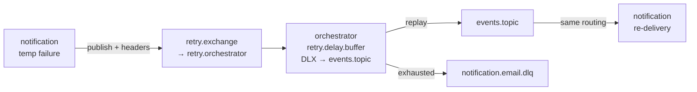
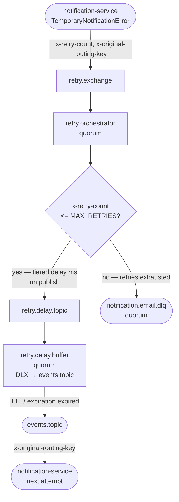
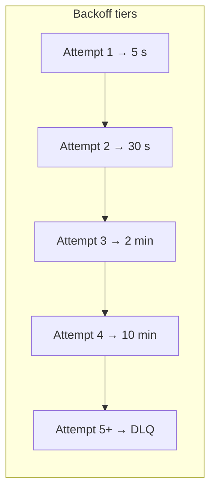

# event-platform-retry-orchestrator-service

Centralized **retry policy** for the event platform: consumes failure messages from `retry.exchange`, applies backoff (per-message TTL into a delay queue with DLX back to `events.topic`), tracks `x-retry-count`, and routes exhausted messages to the **DLQ**.

Work together with **[event-platform-notification-service](../event-platform-notification-service/README.md)** — it forwards temporary failures here (`retry.exchange`, headers `x-retry-count`, `x-original-routing-key`, `x-last-error`). That README describes consumer behaviour, boot order with this service, and DLQ semantics.

## Flow

**Retry loop (read left → right, then the loop back):** notification **publishes to `retry.exchange`** (routing key `retry.notification`); the orchestrator consumes **`retry.orchestrator`** (**quorum**), schedules delay via **`retry.delay.topic` → `retry.delay.buffer`** (**quorum**, per-message `expiration`, DLX back to `events.topic`), then the **original consumer** sees the replay. Exhausted retries go to **`notification.email.dlq`** (**quorum**).







## Repositories

[GitHub: Elena-sky](https://github.com/Elena-sky)

- [event-platform-gateway-api](https://github.com/Elena-sky/event-platform-gateway-api)
- [event-platform-notification-service](https://github.com/Elena-sky/event-platform-notification-service)
- [event-platform-analytics-audit-service](https://github.com/Elena-sky/event-platform-analytics-audit-service)
- [event-platform-retry-orchestrator-service](https://github.com/Elena-sky/event-platform-retry-orchestrator-service)
- [event-platform-infra](https://github.com/Elena-sky/event-platform-infra)

## Requirements

- **Python 3.12 or 3.13**
- RabbitMQ (e.g. [event-platform-infra](https://github.com/Elena-sky/event-platform-infra))

## Boot order

1. Start RabbitMQ (`event-platform-infra`: `docker compose up -d`).
2. Start this service so exchanges/queues/bindings exist **before** producers send retry traffic (notification only declares the retry exchange; this service owns the ingress queue, delay topology, and DLQ bindings).
3. Start **event-platform-notification-service** and **event-platform-gateway-api** as needed.

## Configuration

```bash
cp .env.example .env
```

Align `EVENTS_EXCHANGE`, `DLQ_*`, and broker credentials with the gateway and notification services. `MAX_RETRIES=4` matches the four delay tiers (5s → 30s → 2m → 10m).

## Run locally

```bash
python3.13 -m venv .venv
source .venv/bin/activate
pip install -r requirements.txt
python -m app.main
```

## Run with Docker

```bash
docker compose up --build
```

Requires `EVENT_PLATFORM_NETWORK_NAME` in `.env` to match `event-platform-infra`, and broker hostname `rabbitmq` is set by Compose.

## Development

```bash
pip install -r requirements-dev.txt
ruff check app tests
ruff format app tests
pytest
```
